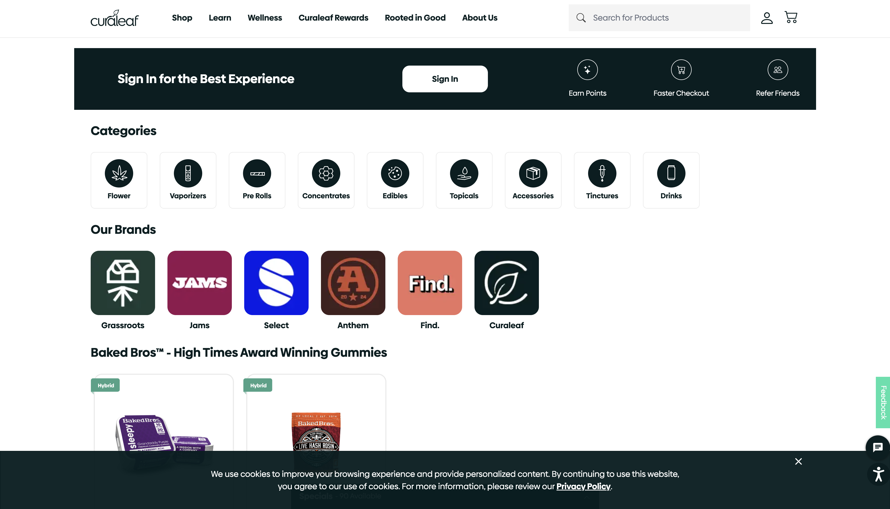

# 🌿 Curaleaf & Select – E-commerce and Analytics Platform  
**Role:** Software Engineering Contractor  
**Client:** Curaleaf / Select Cannabis  
**Duration:** 2020 – 2021  
**Tech Stack:** React.js, Gatsby, Azure Functions, GraphQL, Strapi, TypeScript, AEM, SASS, Supabase, GTM, Braintree

---

  

---

## 🧩 Overview

Curaleaf and its sister brand **Select** are two of the largest cannabis brands in the U.S., offering everything from edibles to wellness products.  
I was brought on as a full-stack contractor to support the **e-commerce platforms, backend integration, QA automation, analytics tagging**, and infrastructure across **Curaleaf.com** and **SelectCannabis.com**.

---

## 🛠️ My Contributions

- 🌐 Built and maintained **React/Gatsby frontends** for both Curaleaf and Select product websites
- 🔗 Integrated **Azure Functions middleware** to manage dynamic backend data sync and Stripe/Braintree payments
- 📊 Embedded **Google Tag Manager** and event tracking across custom e-commerce funnels
- 🧪 Supported **QA, release cycles, and AEM authoring** for multi-state deployments with strict compliance
- 🛍️ Enhanced **SEO, load time, and UI responsiveness** across hundreds of product detail pages

---

## 📊 Results / Impact

- 🚀 Enabled e-commerce access across **18+ state-specific subdomains** with localized product visibility
- 📈 Boosted conversion rates with simplified checkout flow and mobile-first UX adjustments
- 💳 Integrated multiple payment gateways including **TSYS, Braintree, PayPal**
- 🌿 Helped launch curated wellness product lines on **SelectCannabis.com**

---

## 🖼️ Screenshots

### 🧬 Curaleaf – Core Brand Site  

  

> **Enterprise wellness meets cannabis compliance.** Nationally distributed platform with state-level restrictions, location-based menus, and integrated analytics.

---

### 🌈 Select – Product Experience & UI  

  

> **Vibrant, premium, and fast.** The Select brand site was optimized for high visual impact and mobile-first shopping — all backed by React, Strapi, and a custom middleware layer.

---

## 🧠 Engineered for Growth, Built with Precision  
Cannabis tech demands **speed, scale, and airtight compliance**.  
These platforms didn’t just sell products — they handled regulated data, tracked customer journeys, and powered real-time updates across a growing digital footprint.

---
