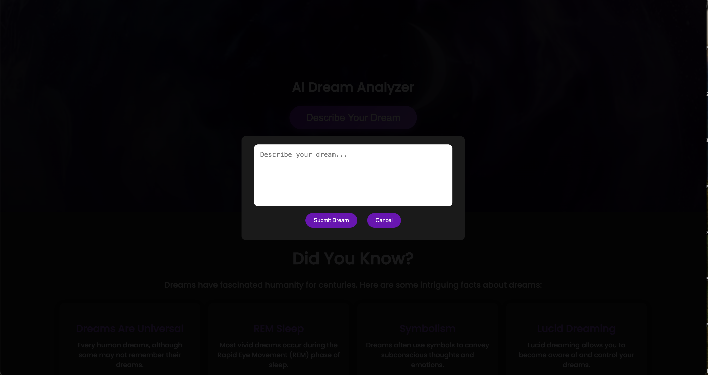

# 🌙 Dreamcatcher – AI-Powered Dream Interpretation Platform  
**Role:** Founder • AI Solutions Architect  
**Project Type:** Personal R&D / SaaS Prototype  
**Duration:** 2024 – Present  
**Tech Stack:** React.js, Next.js, Flask, Supabase, GPT-4, Pinecone, OpenAI API, Tailwind, Vector Search, Semantic Embeddings

---

  

---

## 🧩 Overview

**Dreamcatcher** is a one-of-a-kind AI-powered dream interpretation app designed to turn your subconscious into structured insight. Users log dreams using a simple mobile-friendly interface, which are then **vectorized, analyzed, and decoded** using GPT-4, embedded meanings, and past dream context.

It’s not just a dream journal — it’s an emotional intelligence system for your inner world.

---

## 🛠️ My Contributions

- 🌙 Designed and built the **entire platform architecture**, frontend to AI backend
- 🧠 Integrated **GPT-4 + Pinecone vector database** to map dreams to prior interpretations, themes, and symbols
- 📲 Built **mobile-first UI** with date-stamped dream entries, theme tags, and emotion detection
- 🧾 Enabled **PDF exports, private vs. public journals**, and semantic search over dream logs
- 📡 Engineered a **custom AI routing system** for layered interpretations (surface, psychological, symbolic)

---

## 📊 Results / Impact

- 🧘 Used daily by testers for **self-reflection, pattern recognition, and trauma processing**
- 💡 Custom embeddings allow for **dream clustering by symbol, emotion, or recurring patterns**
- 🔮 Positioned as a future **SaaS wellness product** for therapists, spiritual advisors, and journaling enthusiasts

---

## 🖼️ Screenshots

### 🏠 Dreamcatcher Homepage  

  

> **Dark, inviting, introspective.** The homepage sets a calm tone for users entering vulnerable space. Responsive, accessible, and optimized for night use.

---

### 🌌 Interpretation Engine View  

  

> **Insights unlocked.** Users receive tiered interpretations — surface meaning, psychological patterns, and symbolic analysis — powered by GPT-4 and tailored to their dream history.

---

## 🧠 Not Just Analysis — Emotional Reflection  
Dreamcatcher isn’t built for novelty — it’s a tool for **emotional awareness**, pattern recognition, and **processing the unspoken**.  

It bridges the gap between **AI intelligence** and **human experience**, using your dreams as data and your story as the compass.

---
