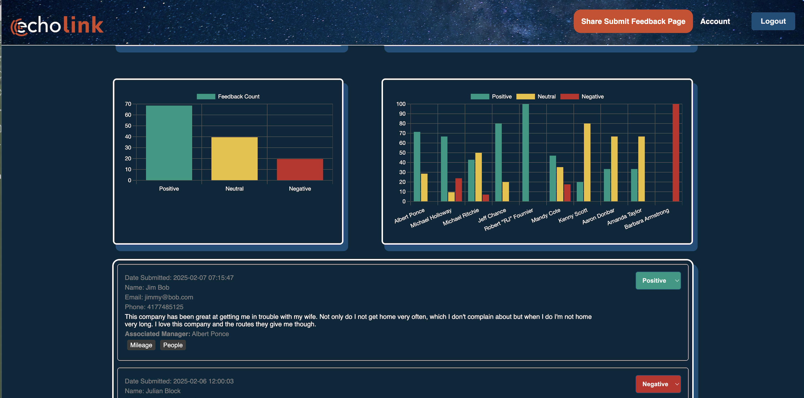

# 🔊 Echolink – Real-Time Sentiment Intelligence Platform  
**Role:** Lead Frontend Engineer / AI Systems Integrator  
**Client:** Ramsey Mediaworks  
**Duration:** 2023 – Present  
**Tech Stack:** React.js, React Native, Flask, Supabase, GPT-4, VADER, TypeScript, Tailwind, Node.js, Docker

---

  

---

## 🧩 Overview

**Echolink** is a real-time sentiment analysis and feedback intelligence platform built for **enterprise trucking clients** like RoadOne, ABF Freight, and Wilson Logistics. It transforms anonymous driver feedback into actionable insights using AI — helping companies reduce churn, optimize operations, and improve morale on the road.

From mobile-friendly check-in flows to AI-generated insights, **Echolink** is the connective tissue between logistics leadership and their fleet.

---

## 🛠️ My Contributions

- 🔧 **Architected the frontend** in React.js + Tailwind for a lightning-fast dashboard experience
- 📱 **Built the mobile interface** using React Native for on-the-go check-ins and feedback submissions
- 🤖 **Integrated sentiment analysis** using VADER, GPT-4, and Supabase vector embeddings
- ⚙️ Developed a **custom admin panel** to configure questions per client and auto-classify responses
- 🔐 Enabled **role-based access**, secure Supabase auth, and QR code-based onboarding
- 📦 Orchestrated deployment using Docker and Supabase functions for real-time data syncing

---

## 📊 Results / Impact

- 🕒 Reduced feedback triage time by **~70%**
- 🔁 Increased repeat driver engagement by **12%**
- 📈 Exec-level insights led to a **measurable uptick in retention**
- 🧠 Praised by C-suite leadership for innovation, usability, and business impact

---

## 🧠 Tech Highlights

### 🧬 Vector-Based Feedback Classification
Each piece of feedback is embedded using OpenAI + Supabase vectors, allowing AI to **instantly match text to predefined issue categories**, saving ops teams hours.

### 🧠 GPT-Powered Sentiment & Suggestions
Feedback not only gets scored — it **responds back intelligently** to the user with insights or helpful links based on tone and urgency.

### 📲 QR Code Onboarding
Each client has a **unique QR code** that opens a mobile feedback UI tied to their brand, location, and customized questions.

---

## 🎥 [Screenshots or Demo Placeholder]
---

## 🖥️ The Experience — Visual Walkthrough

### 🔐 Seamless Login

  

---

### 📊 Real-Time Sentiment Dashboard

  

> **Command center for morale.** Executives and dispatchers gain live visibility into driver sentiment across terminals, issues, and mood categories — all powered by embedded AI.

---

---

## 🚛 Built for the Road — Powered by AI  
Echolink isn't just a form — it’s a **driver relationship engine** disguised as a feedback tool. It listens, learns, and responds — and it's changing how logistics thinks about morale and insight.

---
