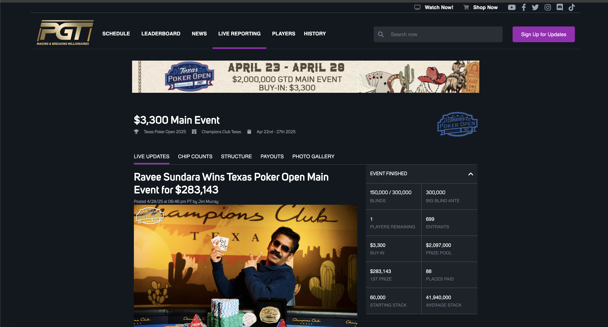
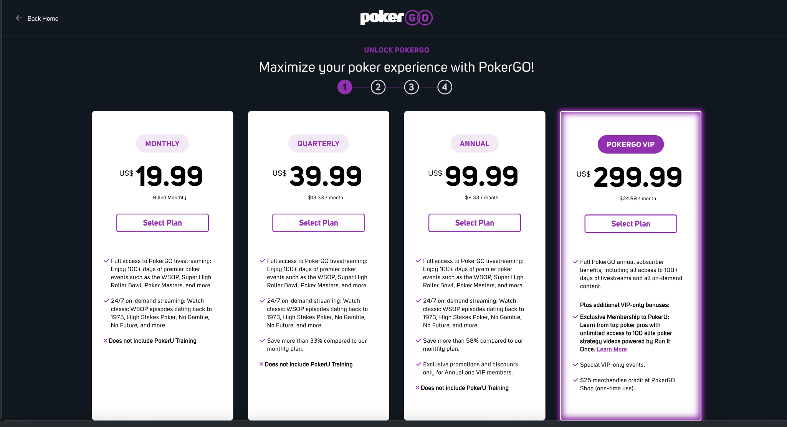

# ♠️ PokerGO – Live Reporting & Data Streaming Platform  
**Role:** Senior Web Developer  
**Client:** PokerGO (World Series of Poker Division)  
**Duration:** 2021 – 2022  
**Tech Stack:** Vue.js, Node.js, Express.js, PHP, AngularJS, Strapi, Ionic, WordPress, MySQL, AEM

---

  

---

## 🧩 Overview

PokerGO is the premier streaming platform for professional poker — including coverage of the **World Series of Poker (WSOP)**. I was brought on to develop and enhance both the **live tournament reporting infrastructure** and the **partner-facing APIs** that power media coverage and data sync during major events.

---

## 🛠️ My Contributions

- 📡 Built the **WSOP Live Reporting web app** for real-time tournament updates, synced across mobile and web
- 🧰 Developed **custom APIs** allowing media partners to access PokerGO data with tiered authentication and rate limits
- 🧭 Built **campaign sites** with A/B tested layouts for subscription conversions tied to WSOP and Poker Masters
- 🧑‍💼 Streamlined internal tooling using Strapi and WordPress for marketing content sync and editorial control
- 📲 Refactored frontend components across Vue.js + AngularJS stack for modern UX performance

---

## 📊 Results / Impact

- 🎥 Supported real-time content delivery during **WSOP 2021**, one of the most-watched tournaments in poker history
- 🌐 Enabled seamless partner syndication with custom APIs used by sports news sites and affiliate networks
- 💰 Boosted PokerGO’s subscription conversion rate via optimized campaign landing experiences
- ⚙️ Improved reporting system reliability, leading to **<1% downtime during all major live events**

---

---

## 🎥 Live Platform Showcase — Visuals

### 🧾 Real-Time Tournament Reporting  

  

> **High-stakes coverage, instant delivery.** The WSOP Live Reporting app streams updates in real time — including chip counts, hand history, and winner tracking — powered by a resilient API and modular frontend.

---

### 🪙 Subscription Landing Page  

  

> **Every chip counts.** Optimized campaign page built to drive subscriptions during high-traffic WSOP periods

## 🧠 Tech Highlights

### ♠️ WSOP Live Reporting Engine  
Designed a frontend application that syncs tournament activity with the backend in near real-time, pulling from dealer and reporter inputs and broadcasting across all PokerGO platforms.

### 📡 Partner API Infrastructure  
Exposed a secure set of partner APIs (player data, chip counts, hand history) using custom auth layers, enabling broadcasters and sites to integrate coverage natively.

### 🎯 Marketing Flexibility with AEM & Strapi  
Enabled non-technical staff to manage high-traffic landing pages with live preview and variant switching for campaigns — reducing dependency on engineering sprints.

---

## ♣️ Engineering at the Table  
PokerGO wasn’t just a content platform — it was a **live sports infrastructure** play that demanded performance, reliability, and cross-platform coverage.  
I helped build the system that made fans, pros, and media feel like they were sitting at the final table.

---
