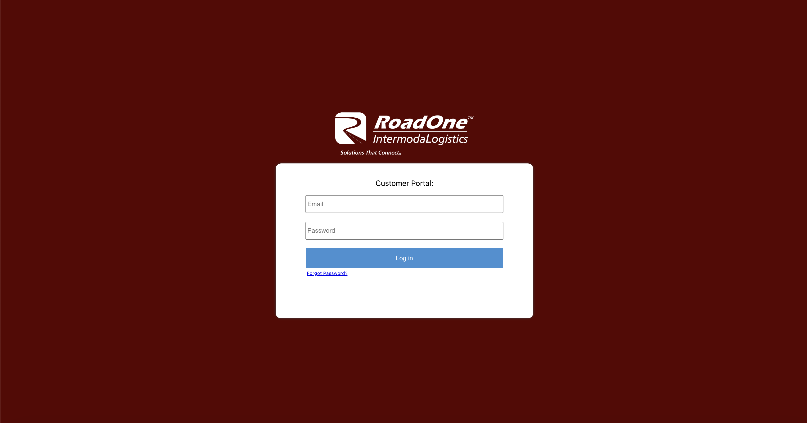
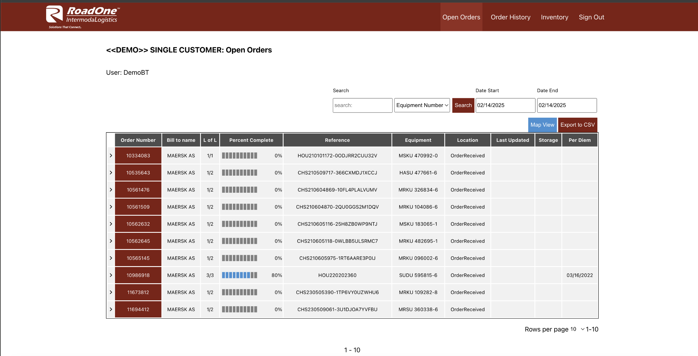
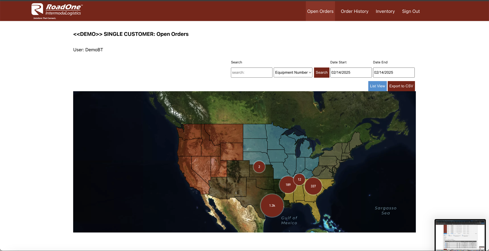
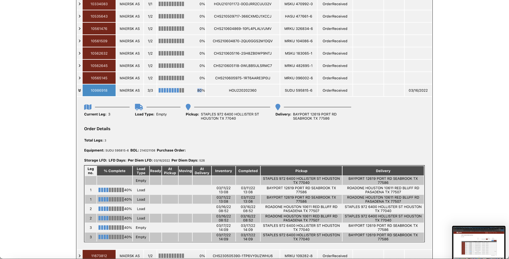

# 🧭 RoadOne Client Portal – Unified Logistics Operations Hub  
**Role:** Lead Frontend Engineer / Full-Stack Architect  
**Client:** RoadOne IntermodaLogistics (via Ramsey Mediaworks)  
**Duration:** 2023 – Present  
**Tech Stack:** React.js, Redux, PHP, Node.js, Supabase, TSYS, Stripe, Tailwind, Docker, MySQL

---

  

---

## 🧩 Overview

The **RoadOne Client Portal** is an enterprise-grade web platform for RoadOne’s clients to **manage operations, payments, dispatch logs, driver feedback, and more** — all in one centralized, secure hub.

Designed for speed, usability, and visibility, the portal gives RoadOne’s national clients real-time insight and control over their logistics workflows.

---

## 🛠️ My Contributions

- 🧱 **Architected the frontend system** using React.js + Redux, fully component-driven with deep form handling
- 💸 Integrated **TSYS + Stripe** payment gateways with secure C#-based backend APIs
- 📍 Developed **real-time route logs**, including admin overrides, filtering, and geolocation data via Mapbox
- 🔒 Built **client-specific permissioning and views**, allowing granular access per user type
- 📦 Created **custom grid components** for dispatch management and dynamic rate override logic
- 📊 Enhanced reporting with printable invoice summaries and embedded PDF generation

---

## 📊 Results / Impact

- ⏱ Saved client service teams **dozens of hours/week** through automation and visibility
- 💰 Enabled $10M+ in transactions via seamless payment integrations
- 🧠 Reduced support ticket volume by **30%** thanks to proactive feedback & reporting tools
- 🙌 Praised by RoadOne’s leadership for clarity, UX polish, and technical resilience

---

---

## 🖥️ The Portal in Action — Visual Showcase

### 🔐 Client Login Portal  

  

> **Secure & Branded Access.** Each client logs into a branded, secure entry point—designed for fast access, minimal friction, and real-time validation.

---

### 🏠 Operations Home Dashboard  

  

> **Your Logistics Command Center.** At-a-glance visibility into dispatch summaries, invoices, upcoming payments, and driver feedback — all in one clean view.

---

### 📦 Real-Time Dispatch Tracker  

  

> **Live load status, terminal logs, and driver updates.** Track routes, terminal activity, and custom flags with real-time sync and override alerts.

---

### 📊 Client Dashboard & Invoice Summary  

  

> **Invoice automation meets smart filtering.** Generate and download branded summaries, filter by date or status, and manage payment visibility for client-facing records.

---

## 🧠 Tech Highlights

### 📦 Dynamic Dispatch Grid System
A highly customizable dispatch management interface with client-specific columns, filters, and override indicators — including logic that flags custom pricing entries and status mismatches in real time.

### 💳 Secure Multi-Gateway Payments
Integrated both **TSYS** and **Stripe** to allow flexible payments — with routing logic depending on account metadata, payment type, and terminal location.

### 📁 Admin-Friendly Document Tools
Admins can generate PDF summaries of logs and transactions, complete with branding, date filters, and downloadable receipts.

---

## 🛠 Built for Enterprise. Designed for Speed.  
This portal wasn't built to impress — it was built to **serve thousands of users with clarity, security, and reliability**, and it’s now a **core business tool** for one of the nation’s largest intermodal logistics providers.

---
